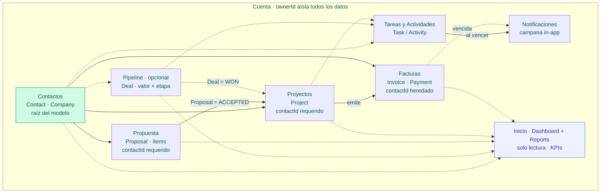

# Trato — CRM para Freelancers y Agencias

**Trato** es un CRM para freelancers y pequeñas agencias de software, en un
monorepo construido como **monolito modular**: un solo despliegue y una sola
base de datos, con el código dividido en módulos de dominio de fronteras
estrictas.

Centraliza la relación comercial completa en una sola app: desde el primer
contacto de un prospecto, pasando por el pipeline de ventas y las propuestas,
hasta los proyectos contratados y su facturación.

## Funcionalidades

| Área | Qué incluye |
| ---- | ----------- |
| Contactos y empresas | CRUD con búsqueda, vínculo contacto ↔ empresa, perfil **360°** (datos + timeline + oportunidades + propuestas + proyectos + etiquetas + adjuntos). El contacto es la **raíz del modelo**: todo documento cuelga de él |
| Pipeline de ventas | Tablero **kanban** con 6 etapas y drag & drop, motivo de pérdida, historial de cambios de etapa. **Desacoplado**: es seguimiento opcional, ni propuestas ni proyectos dependen de él |
| Propuestas | Ítems (descripción, cantidad, precio) con total calculado; **cliente obligatorio**; estados Borrador → Enviada → Aceptada/Rechazada; al aceptarla se **convierte en proyecto** con un clic |
| Proyectos | **Cliente obligatorio**; nacen sueltos, de una **propuesta aceptada** o de una **oportunidad ganada** (1:1 en ambos casos); hitos con fechas y estado |
| Facturación | Factura desde proyecto (**hereda su cliente**), numeración automática (`INV-0001`…), pagos parciales (auto-marca Pagada), **exportación a PDF** con los datos del perfil de empresa |
| Actividades y tareas | Notas/llamadas/correos/reuniones ligadas a contacto, oportunidad **o proyecto**; timeline cronológica; tareas con vencimiento |
| Etiquetas | Tags de color reutilizables en contactos y oportunidades, con filtro en el listado |
| Adjuntos | Referencias por URL (Drive, Dropbox…) en contactos, oportunidades y proyectos |
| Notificaciones | Campana in-app con contador; jobs diarios que avisan de tareas y facturas vencidas |
| Búsqueda global | `Ctrl/Cmd+K` en la topbar: busca contactos, oportunidades, proyectos y propuestas a la vez |
| Dashboard | Valor en pipeline, cobros pendientes, ingresos del mes, tareas del día |
| Modo agencia | El ADMIN invita miembros (rol MEMBER) que comparten la cartera de la cuenta; datos aislados por cuenta y gestión de equipo protegida por rol |
| Time-tracking | Registro de horas por proyecto con total dedicado |
| Plantillas | Plantillas de propuesta reutilizables que precargan ítems al crear |

## Flujo de uso

El **cliente es la raíz**: toda propuesta, proyecto y factura debe poder
responder «¿de qué cliente es?» sin saltos frágiles.

1. **Contacto (cliente)** — alta de la persona (y su empresa). Su ficha 360° concentra todo lo demás.
2. **Propuesta** — cotización con ítems y total, **siempre de un cliente**; al marcarla Aceptada se convierte en proyecto con un clic.
3. **Proyecto** — del cliente. Puede nacer de una propuesta aceptada, de una oportunidad ganada o suelto (eligiendo el cliente a mano); se le añaden hitos, tareas y tiempo.
4. **Factura** — se emite desde el proyecto y **hereda su cliente**; se registran pagos y se descarga en PDF.
5. **Oportunidad** *(opcional)* — el kanban es seguimiento comercial **desacoplado**: útil para trabajar el pipeline, pero nada depende de él.

### Diagrama del ciclo y relaciones entre módulos

Todo cuelga del contacto (líneas continuas). Un proyecto puede originarse por
dos puertas, ambas 1:1 y excluyentes entre sí: **`Proposal = ACCEPTED`**
(`Project.proposalId` es único) o **`Deal = WON`** (`Project.dealId` es único).
Las líneas punteadas son relaciones transversales, opcionales o de solo lectura.
Todo queda aislado por `ownerId`.



**Integridad relacional (reglas que aplican los servicios):**

- `Proposal.contactId` y `Project.contactId` son **obligatorios**; la API rechaza
  crearlos sin cliente.
- `Invoice.contactId` **nunca viene del request**: el servicio lo deriva siempre
  del proyecto (`ProjectsService.getContactId`). Está denormalizado a propósito —
  una factura es un documento histórico y conserva el cliente del momento en que
  se emitió.
- **Coherencia**: si una propuesta o un proyecto referencian una oportunidad, esa
  oportunidad debe ser del mismo cliente (si no, `400`). Convertir una
  oportunidad ganada exige que tenga cliente asignado.
- `Task`/`Activity` aceptan `contactId`, `dealId` y `projectId`, todos opcionales
  e independientes: son anotaciones flexibles y **no** se les exige coherencia
  cruzada.
- Borrar un contacto con **proyectos o facturas** está **bloqueado**
  (`onDelete: Restrict`): hay que reasignarlos o borrarlos antes. Las
  **propuestas** aún usan `SetNull` (quedarían sin cliente); la migración
  *contract* pendiente lo endurece a `Restrict`.

Los jobs programados (diarios y al arrancar el servidor) detectan tareas y
facturas vencidas y generan avisos en la campana, con deduplicación para que
las re-ejecuciones no dupliquen notificaciones.

## Stack

| Capa        | Tecnología                                   |
| ----------- | -------------------------------------------- |
| Backend     | NestJS 11 + TypeScript                       |
| ORM / BD    | Prisma 7 (driver adapter `pg`) + PostgreSQL  |
| Auth        | JWT access + refresh (passport-jwt)          |
| Seguridad   | Helmet · CORS restringido · rate limiting · validación DTO |
| Frontend    | React 19 + Vite + TypeScript + Tailwind CSS v4 |
| Datos (cli) | TanStack Query + Axios                       |
| Infra local | Docker + docker-compose                      |

## Estructura

```text
crm_freelance/
├── backend/      # API NestJS (monolito modular)
│   ├── src/
│   │   ├── modules/      # un módulo por dominio (auth, contacts, deals, …)
│   │   ├── common/       # guards, decorators compartidos
│   │   ├── prisma/       # PrismaService (global)
│   │   └── generated/    # cliente Prisma generado (ignorado por git)
│   └── prisma/schema.prisma
├── frontend/     # SPA React + Vite + Tailwind
│   └── src/
│       ├── features/     # una carpeta por dominio (espeja el backend)
│       ├── components/   # UI y layout compartidos
│       └── lib/          # cliente axios, query client, tema
└── docker-compose.yml
```

## Módulos

Los 14 módulos de dominio están montados en el backend:

`auth` · `users` · `contacts` · `deals` · `proposals` · `projects` ·
`activities` · `invoices` · `tags` · `files` · `notifications` ·
`settings` · `reports` · `dashboard`

El frontend cuenta con páginas para: dashboard, contactos (listado + detalle
360°), oportunidades (tablero kanban), propuestas, proyectos, tareas, facturas
y configuración; más componentes transversales embebibles (timeline de
actividad, campana de notificaciones, búsqueda global, etiquetas y adjuntos).

> **Regla de fronteras:** un módulo nunca consulta las tablas de otro; pide la
> información al servicio público del módulo dueño (patrón `assertOwned`).

## Lógica de arquitectura

- **Flujo de cada request:** `Controller` (HTTP + validación DTO) → `Service`
  (toda la lógica de negocio) → `PrismaService` (único acceso a BD).
- **Aislamiento por cuenta:** toda fila tiene `ownerId` y toda consulta filtra
  por él; el id sale del JWT (`@CurrentUser`), nunca del body. Es el invariante
  que cubren los tests unitarios (`*.service.spec.ts`, con Prisma mockeado).
- **Comunicación entre módulos:** vía servicios exportados (`assertOwned` para
  validar ids ajenos). Los módulos de solo lectura (`dashboard`, `reports`)
  componen las lecturas públicas de los demás.
- **Jobs y notificaciones:** los schedulers viven en el módulo dueño del dato
  (`activities/tasks.scheduler.ts`, `invoices/invoices.scheduler.ts`), corren a
  diario y en el arranque, e importan `notifications` para crear avisos con
  `createIfAbsent` (idempotente por `userId + type + link`). La única
  excepción al filtro por `ownerId` son sus lecturas de ámbito sistema, que
  nunca se exponen por controller.
- **Vistas agregadas en el cliente:** el 360° del contacto y la búsqueda
  global componen queries paralelas (TanStack Query) contra los endpoints de
  cada módulo, en lugar de endpoints agregados en el backend que acoplarían
  módulos en ciclos.
- **PDF de facturas:** se genera en el backend (`pdfkit`) en
  `GET /api/invoices/:id/pdf`, tomando el perfil de empresa del módulo
  `settings` a través de su servicio exportado.
- **Eje cliente en fase *expand*:** `Project.contactId`, `Invoice.contactId` y
  `Proposal.contactId` se añadieron con migraciones **expand** (columna nullable
  + backfill de lo derivable), porque forzar `NOT NULL` de golpe habría roto la
  migración sobre datos reales. Hoy la obligatoriedad **se aplica en la capa de
  servicio**, no en la BD. Quedan filas legacy sin cliente; una vez saneadas con
  `backend/prisma/scripts/sanitize-legacy-clients.sql`, la migración **contract**
  (`backend/prisma/scripts/contract-not-null.sql`) añade el `NOT NULL` definitivo.
  Ojo: el `contactId` de las facturas está denormalizado, así que reasignar el
  cliente de un proyecto **no** actualiza sus facturas — el script las re-deriva.

## Puesta en marcha (desarrollo local)

### 1. Base de datos

Con Docker (Postgres queda en el puerto **5433** del host para no chocar con un
Postgres local en el 5432):

```bash
docker compose up -d db
```

O usa cualquier PostgreSQL y ajusta `DATABASE_URL` en `backend/.env`.

### 2. Backend

```bash
cd backend
cp .env.example .env        # ajusta secretos JWT y DATABASE_URL
npm install
npx prisma generate         # genera el cliente en src/generated/prisma
npx prisma migrate dev      # crea las tablas a partir del esquema
npm run start:dev           # API en http://localhost:3000/api
```

- Salud: `GET http://localhost:3000/api/health`
- Docs (Swagger): `http://localhost:3000/api/docs`

### 3. Frontend

```bash
cd frontend
npm install
npm run dev                 # SPA en http://localhost:5173
```

Vite hace proxy de `/api` al backend en el puerto 3000.

### Todo con Docker

```bash
docker compose up --build   # db + backend + frontend
```

## Scripts útiles

| Ámbito   | Comando                | Descripción                             |
| -------- | ---------------------- | --------------------------------------- |
| backend  | `npm run start:dev`    | API con hot-reload                      |
| backend  | `npm run build`        | Compila a `dist/`                       |
| backend  | `npm run lint`         | ESLint (`--fix`)                        |
| backend  | `npm test`             | Jest (`npm test -- contacts` para filtrar) |
| backend  | `npm run seed`         | Puebla una cuenta demo con datos de ejemplo |
| backend  | `npx prisma migrate dev` | Aplica/crea migraciones               |
| backend  | `npx prisma studio`    | Explorador de datos                     |
| frontend | `npm run dev`          | Servidor de desarrollo Vite             |
| frontend | `npm run build`        | `tsc -b && vite build`                  |
| frontend | `npm run lint`         | **oxlint** (no ESLint)                  |

Tras `npm run seed` puedes entrar como **ADMIN** con `demo@crm.test` / `demo1234`
o como **MEMBER** con `miembro@crm.test` / `demo1234` (ambos comparten la misma
cartera). Incluye contactos, pipeline, propuestas, proyectos, facturas, tiempo
registrado y una plantilla de ejemplo.

Cada PR ejecuta el workflow de CI (`.github/workflows/ci.yml`): lint + tests +
build de backend y frontend.

## Convenciones

- Código (variables, clases, endpoints) en **inglés**; comentarios y UI en **español**.
- Cada módulo NestJS: `*.module.ts`, `*.controller.ts`, `*.service.ts`, `dto/`.
- Sin lógica de negocio en los controladores; sin acceso directo a tablas de otro módulo.
- Toda entrada se valida con DTOs + class-validator.
- Aislamiento por cuenta: cada consulta filtra por `ownerId` (tomado del JWT).
- Orden de implementación del MVP: `auth → contacts → deals → proposals → projects → activities → invoices → resto`.
